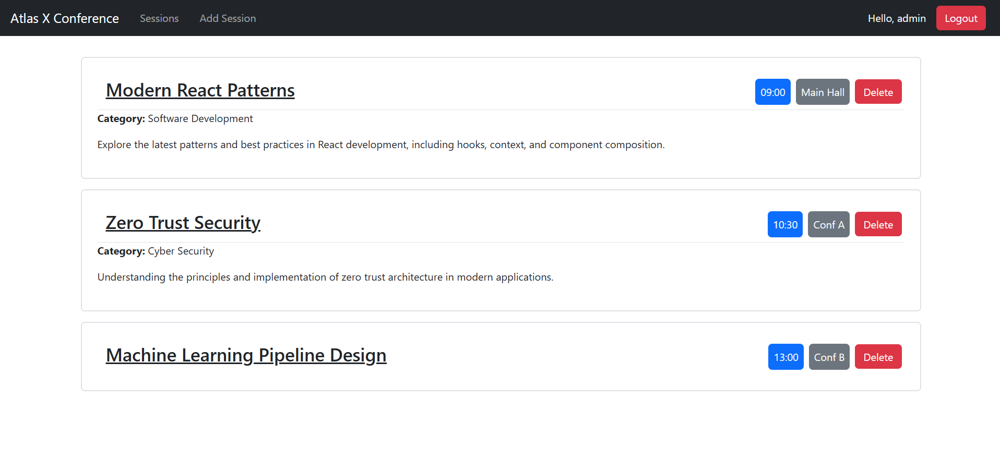
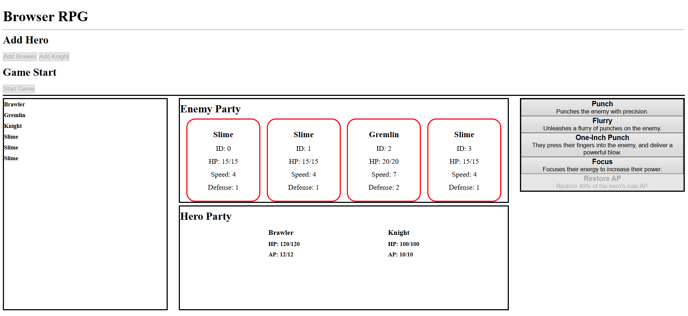

# Jonas Mast - Full Stack Engineer
 
## About Me

I'm a Full Stack Engineer currently studying at Atlas Coding School in Tulsa, Oklahoma. I've always been interested in computers and the code behind websites, apps, and video games. Now I'm learning how to write that code using modern programming languages and frameworks.

 I am proficient in Typescript, React, Node.js, and Express.js. I have a passion for building interactive web applications and continuously improving my software development skills. I'm interested in roles that allow me to work with talented teams, contribute to innovative projects, and grow as a developer. 

 I'm excited to learn more about software development and see what lies ahead in my career!

 ## Projects

 ### [Atlas X React App](https://github.com/wrinkly-brain/AtlasX-React-App)
 

#### [Live Atlas X React App Site](https://atlasx-react-app.netlify.app)

This app was built with React and JavaScript. It uses role-based authentication to only allow admin users to manage conference sessions. Regular users can only view sessions.

### [RPG Site](https://github.com/wrinkly-brain/AtlasX-React-App)

#### [Live RPG Site](https://rpg-site.netlify.app)

This website is a work in progress web game built with HTML, CSS, and JavaScript. It features the basic game mechanics of a turn-based RPG. I plan to continue adding features and improving the gameplay.

### [Task Manager API](https://github.com/wrinkly-brain/Task-Management-API)

This is a RESTful API for managing tasks, built with Node.js, Express.js, Prisma. It allows users to create, read, update, and delete tasks. The API also includes user authentication and authorization features.

## Resume
You can view and download my resume here: 

[Jonas Mast Resume (PDF)](Jonas-Mast-Software-Engineer-Resume.pdf)

## Contact Me
Feel free to reach out to me through email or LinkedIn!
### Email:
[jonas.lee.mast@gmail.com](mailto:jonas.lee.mast@gmail.com)

### LinkedIn:
[Jonas Mast](https://www.linkedin.com/in/jonas-lee-mast/)

